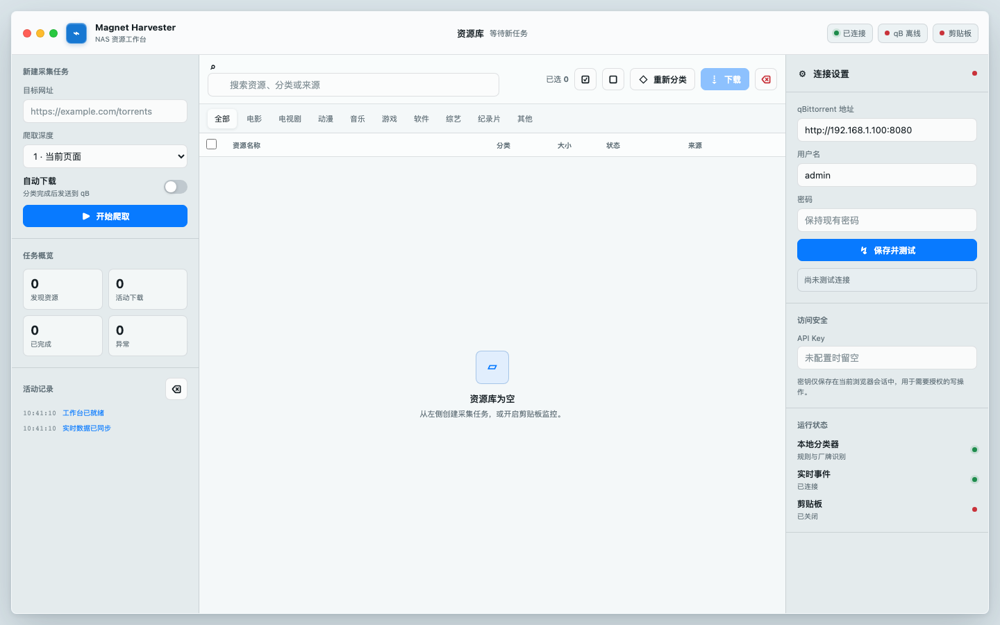

# Magnet Harvester

通用磁力链接采集与分类服务。抓取网页中的 magnet 链接，用本地规则智能分类，并将任务发送到 qBittorrent 下载到 NAS。

## 当前能力

- 基于 `Scrapling` (Playwright) 抓取页面和子链接中的 magnet
- **本地规则分类**：关键词匹配 + 通用规则，覆盖常见资源类型
- 支持站点 Cookie 注入，爬取需要登录的网站
- **系统剪贴板监控**：自动检测复制到的 magnet 链接，分类后加入表格
- 通过 qBittorrent Web API v2 自动建分类并添加下载
- 单页 Web UI，macOS 风格工作台，实时进度、筛选、重分类和批量下载
- qB 连接状态面板（在线/离线/检测中 + 状态指示灯）

## 架构

```text
┌─────────────┐     ┌─────────────┐     ┌────────────────┐
│   Web UI    │────▶│  FastAPI    │────▶│  MagnetCrawler │
│ index.html  │◀────│  main.py    │◀────│   Scrapling    │
└─────────────┘     └──────┬──────┘     └───────┬────────┘
                           │                    │
        ┌──────────────────┼────────────────────┼──────────────┐
        ▼                  ▼                    ▼              ▼
   ┌───────────┐    ┌──────────────┐    ┌────────────┐  ┌──────────┐
   │ Classifier│    │ SiteAuth     │    │MagnetParser│  │ qBittorrent
   │ rules     │    │ Cookie注入    │    │ regex      │  │ Client  │
   └───────────┘    └──────────────┘    └────────────┘  └──────────┘
                           ▲
                    ┌──────────────┐
                    │ClipboardMon  │
                    │ pyperclip轮询 │
                    └──────────────┘
```

### 适用磁力站

适合抓取公开页面中直接暴露 magnet 链接，或详情页可以解析出 magnet 的站点，例如：

- BT4G
- BTDig
- Nyaa
- Sukebei
- Tokyo Toshokan
- The Pirate Bay 镜像站
- 1337x 镜像站
- RARBG 镜像/索引站
- 磁力猫/磁力链索引类站点
- 其他 BT/Magnet 搜索页或论坛详情页

需要登录的站点可通过 `SITE_COOKIES` 注入 Cookie。请仅抓取你有权访问和下载的内容；实际可抓取范围取决于页面是否包含 `magnet:?xt=urn:btih:` 链接，以及目标站点的访问策略。

## 前端展示



Web UI 是无构建步骤的单页应用，直接由 FastAPI 提供：

- 左侧：采集任务、自动下载开关、任务统计和活动日志
- 中央：资源库表格、分类筛选、搜索、选择、重分类和批量下载
- 右侧：qBittorrent 连接设置、API Key 会话输入、运行状态
- 顶部：WebSocket、qBittorrent、剪贴板监控状态
- 移动端：底部分段导航，在“采集 / 资源库 / 设置”之间切换

前端不依赖外部字体、CDN 或打包工具；所有界面逻辑都在 `static/index.html`。

## 快速开始

### 前置条件

- Python 3.11+
- 可访问的 qBittorrent Web UI (v4.1+)
- Playwright Chromium (`playwright install chromium`)

### 安装

```bash
git clone https://github.com/ashllll/qb-nas.git
cd qb-nas

python -m pip install -r requirements.txt
playwright install chromium

cp .env.example .env
# 编辑 .env 填入 qBittorrent 连接信息
```

### 配置

`.env` 常用配置项：

| 变量                          | 说明                       | 默认值                      |
| ----------------------------- | -------------------------- | --------------------------- |
| `QBIT_HOST`                   | qBittorrent Web UI 地址    | `http://192.168.1.100:8080` |
| `QBIT_USERNAME`               | qB 用户名                  | `admin`                     |
| `QBIT_PASSWORD`               | qB 密码                    | —                           |
| `SERVICE_HOST`                | 服务监听地址               | `127.0.0.1`                 |
| `SERVICE_PORT`                | 服务端口                   | `8899`                      |
| `API_KEY`                     | 写操作 `X-API-Key`         | 空（仅 loopback）           |
| `ALLOW_INSECURE_WRITE_API`    | 允许非 loopback 无认证     | `false`                     |
| `SITE_COOKIES`                | 站点 Cookie 注入           | `{}`                        |
| `CRAWLER_TIMEOUT`             | 抓取超时秒                 | `30`                        |
| `CRAWLER_MAX_DEPTH`           | 最大深度                   | `2`                         |
| `CRAWLER_CONCURRENCY`         | 并发数                     | `6`                         |
| `CRAWLER_MAX_DETAIL_LINKS`    | 单次深爬最多详情页数       | `200`                       |
| `CRAWLER_ALLOWED_RESOLUTIONS` | 爬虫必须保留的清晰度关键词 | `2160p,4k`                  |
| `CRAWLER_WAIT_UNTIL`          | 页面等待阶段               | `load`                      |
| `CRAWLER_DELAY_BEFORE_HTML`   | 取 HTML 前额外等待秒       | `1.0`                       |
| `CRAWLER_SCAN_FULL_PAGE`      | 抓取前滚动完整页面         | `true`                      |
| `CRAWLER_MAX_SCROLL_STEPS`    | 最大滚动步数               | `8`                         |
| `CRAWLER_PROCESS_IFRAMES`     | 合并 iframe 内容           | `true`                      |
| `CRAWLER_FLATTEN_SHADOW_DOM`  | 展开 Shadow DOM            | `true`                      |
| `FS_BASE_PATH`                | 本地可写目录（可选）       | 空                          |
| `MIN_DISK_SPACE_GB`           | 磁盘告警阈值               | `10.0`                      |

#### 爬取需要登录的网站

```bash
# .env 中添加
SITE_COOKIES={"example.com": "uid=123; sid=abc; token=xyz"}
```

获取方式：浏览器登录目标网站 → F12 → Application → Cookies → 拼接为 `name=value; name2=value2` 格式。重启服务后自动注入到爬虫浏览器。

#### 剪贴板监控

点击顶部状态栏的 **"剪贴板监控"** pill 开关，开启后自动检测系统剪贴板中复制的 magnet 链接：

```
复制磁力链接 → 自动提取 btih + dn= 名称 → 本地规则分类 → 加入表格 → 可一键下载
```

无需额外配置，监控仅检测 `magnet:?xt=urn:btih:` 开头的链接。

### 本地启动

```bash
python run.py
```

访问 http://localhost:8899

## 使用流程

1. 输入目标 URL，选择爬取深度（1-3）
2. 可选开启自动下载
3. 磁力实时出现在中央表格，按分类筛选
4. 选择条目点击"下载"发送到 qBittorrent
5. 右侧面板可修改 qB 连接并测试

## 部署流程

### 1. 准备运行环境

```bash
git clone https://github.com/ashllll/qb-nas.git
cd qb-nas

python -m venv .venv
source .venv/bin/activate
python -m pip install -r requirements.txt
playwright install chromium
```

macOS / Linux 使用 `source .venv/bin/activate`，Windows PowerShell 使用：

```powershell
.\.venv\Scripts\Activate.ps1
```

### 2. 配置 `.env`

```bash
cp .env.example .env
```

至少配置：

```env
QBIT_HOST=http://你的-qb-host:8080
QBIT_USERNAME=你的用户名
QBIT_PASSWORD=你的密码
SERVICE_HOST=127.0.0.1
SERVICE_PORT=8899
```

也可以首次启动后在前端保存 qBittorrent 地址、用户名和密码；保存成功会写回 `.env`，服务重启后继续使用同一配置。

如果要让局域网其他设备访问，不要裸露无认证写接口。设置强随机 `API_KEY`：

```env
SERVICE_HOST=0.0.0.0
API_KEY=换成一串足够长的随机密钥
ALLOW_INSECURE_WRITE_API=false
```

前端右侧“访问安全 / API Key”输入同一密钥后，即可执行爬取、下载、清空、配置保存等写操作。

### 3. 启动服务

开发或手动运行：

```bash
python run.py
```

后台运行示例：

```bash
nohup .venv/bin/python run.py > magnet-harvester.log 2>&1 &
```

访问：

```text
http://服务器地址:8899
```

### 4. systemd 部署示例（Linux NAS）

创建 `/etc/systemd/system/magnet-harvester.service`：

```ini
[Unit]
Description=Magnet Harvester
After=network-online.target
Wants=network-online.target

[Service]
Type=simple
WorkingDirectory=/opt/qb-nas
EnvironmentFile=/opt/qb-nas/.env
ExecStart=/opt/qb-nas/.venv/bin/python /opt/qb-nas/run.py
Restart=on-failure
RestartSec=5
User=nas
Group=nas

[Install]
WantedBy=multi-user.target
```

启用：

```bash
sudo systemctl daemon-reload
sudo systemctl enable --now magnet-harvester
sudo systemctl status magnet-harvester
```

查看日志：

```bash
journalctl -u magnet-harvester -f
```

### 5. 更新部署

```bash
cd /opt/qb-nas
git pull --ff-only
source .venv/bin/activate
python -m pip install -r requirements.txt
playwright install chromium
sudo systemctl restart magnet-harvester
```

更新后建议打开 Web UI 确认顶部状态栏：

- WebSocket：已连接
- qB：在线
- 剪贴板：按需开启

## API

| 方法        | 路径                   | 说明                      |
| ----------- | ---------------------- | ------------------------- |
| `POST`      | `/api/crawl`           | 发起爬取                  |
| `POST`      | `/api/download`        | 批量下载                  |
| `POST`      | `/api/reclassify`      | 重新分类                  |
| `GET`       | `/api/items`           | 列出条目（支持筛选/分页） |
| `GET`       | `/api/items/search`    | 关键字搜索                |
| `DELETE`    | `/api/items`           | 清空条目                  |
| `GET`       | `/api/categories`      | 分类列表                  |
| `GET`       | `/api/status`          | qB 状态 + 条目数          |
| `GET`       | `/api/health`          | 健康检查                  |
| `GET`       | `/api/config`          | qB 连接配置               |
| `PUT`       | `/api/config`          | 更新 qB 连接              |
| `GET`       | `/api/errors`          | 错误列表                  |
| `GET`       | `/api/clipboard`       | 剪贴板监控状态            |
| `POST`      | `/api/clipboard/start` | 开启剪贴板监控            |
| `POST`      | `/api/clipboard/stop`  | 关闭剪贴板监控            |
| `WebSocket` | `/ws`                  | 实时事件推送              |

## 项目结构

```text
qb-nas/
├── run.py                          # 入口脚本
├── magnet_harvester/
│   ├── main.py                     # FastAPI 应用 + lifespan
│   ├── config.py                   # Pydantic 配置 (Settings)
│   ├── models.py                   # Pydantic 模型
│   ├── errors.py                   # 错误处理 (ErrorHandler)
│   ├── crawler.py                  # Scrapling 爬虫 + Cookie 注入
│   ├── magnet_parser.py            # magnet 正则提取
│   ├── pipeline.py                 # 爬取→分类→下载管道
│   ├── store.py                    # ItemStore (内存存储)
│   ├── bus.py                      # MessageBus (事件总线)
│   ├── assembly.py                 # 运行时装配 (build_runtime)
│   ├── api/
│   │   ├── routes.py               # REST API
│   │   ├── websocket.py            # WebSocket 广播
│   │   └── pages.py                # 静态页面路由
│   ├── classifier/
│   │   ├── local_classifier.py     # 主分类器
│   │   ├── keyword_recognizer.py   # 关键词匹配
│   │   └── fallback.py             # 通用规则 (47条)
│   ├── qbit_client/
│   │   ├── client.py               # qB API v2 客户端
│   │   ├── paths.py                # 路径解析 + 安全处理
│   │   └── __init__.py
│   ├── services/
│   │   ├── qbit_sync.py            # qB 状态同步循环
│   │   ├── site_auth.py            # 站点 Cookie 注入
│   │   ├── clipboard_monitor.py    # 剪贴板监控 (pyperclip)
│   │   ├── stats.py                # 运行时统计
│   │   └── __init__.py
│   ├── context/
│   │   └── app_context.py          # AppContext + 依赖注入
│   └── utils/
│       ├── auth.py                 # API Key 认证
│       ├── url_validator.py        # SSRF 防护 + URL 验证
│       ├── serializers.py          # 响应序列化
│       └── bg_tasks.py             # 后台任务管理
├── static/
│   └── index.html                  # Web UI 单页应用
├── config/
│   └── category_keywords.json      # 关键词规则配置
├── tests/                          # 单元测试
├── .env.example                    # 环境变量模板
└── requirements.txt
```

## 核心实现

- **分类引擎**：关键词精确匹配 + 通用正则，覆盖电影、电视剧、动漫、音乐、游戏、软件、综艺、纪录片和其他资源类型
- **前端界面**：`static/index.html` 单文件工作台，无构建步骤；FastAPI 通过 `/static` 提供资源，根路径 `/` 返回页面
- **爬虫调度**：Scrapling `AsyncDynamicSession` 抓取页面，项目内受限 BFS 负责详情页发现、去重和深度遍历，结果流式回传到 WebSocket
- **动态页面抓取**：通过 Scrapling 浏览器会话加载动态页面，再解析页面内容中的磁力链接
- **Cookie 注入**：`SITE_COOKIES` JSON 配置 → Scrapling 浏览器会话 cookies，支持多域名
- **qB 客户端**：Cookie SID 认证 + 403 自动重登录 + 重试机制。`ensure_category` 带锁防并发竞态，`use_auto_torrent_management` 自动路由
- **状态同步**：QBitSyncLoop 每 2 秒轮询 `/sync/maindata`，仅终态变化时触发前端通知，避免日志刷屏
- **URL 安全**：RFC 1918 精确检查（10/172.16/192.168 + fc00::/7），DNS 解析后验证，防 SSRF
- **剪贴板监控**：`pyperclip` 轮询系统剪贴板 (1s)，提取 `btih` + `dn=` 名称，经过本地规则分类后发布 `MAGNET_FOUND` 事件，实时显示在 Web UI 表格中

## License

MIT
